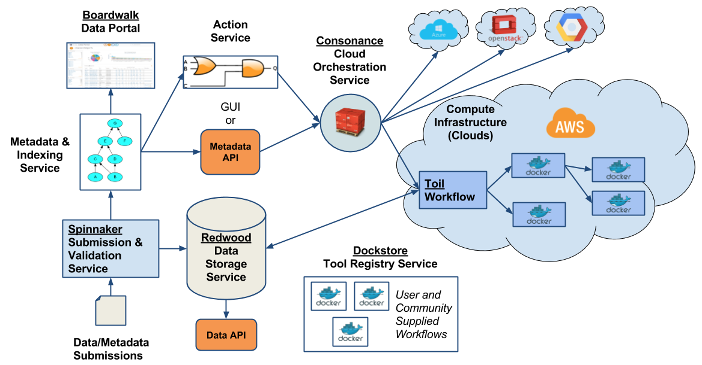

# dcc-ops

## About

This repository contains our Docker-compose and setup bootstrap scripts used to create a deployment of the [UCSC Genomic Institute's](http://ucsc-cgl.org) Computational Genomics Platform for AWS.  The system is designed to receive genomic data, run analysis at scale on the cloud, and return analyzed results to authorized users.  It uses, supports, and drives development of several key GA4GH APIs and open source projects. In many ways it is the generalization of the [PCAWG](https://dcc.icgc.org/pcawg) cloud infrastructure developed for that project and a potential reference implementation for the [NIH Commons](https://datascience.nih.gov/commons) concept.

## Components

The system has components fulfilling a range of functions, all of which are open source and can be used independently or together.



These components are setup with the install process available in this repository:

* [Spinnaker](spinnaker/README.md): our data submission and validation system
* [Redwood](redwood/README.md): our cloud data storage and indexer based on the ICGC Cloud Storage system
* [Boardwalk](boardwalk/README.md): our file browsing portal on top of Redwood
* [Consonance](consonance/README.md): our multi-cloud workflow orchestration system
* [Action Service](action/README.md): a Python-based toolkit for automating workflow execution

These are related projects that are either already setup and available for use on the web or are used by components above.

* [Dockstore](http://dockstore.org): our workflow and tool sharing platform
* [Toil](https://github.com/BD2KGenomics/toil): our workflow engine, these workflows are shared via Dockstore

## Installing the Platform

These directions below assume you are using AWS.  We will include additional cloud instructions as `dcc-ops` matures.

### Collecting Information

Make sure you have:

* your AWS key/secret key
* you know what region you're running in e.g. `us-west-2`

### Starting an AWS VM

Use the AWS console or command line tool to create a host. For example:

* Ubuntu Server 16.04
* r4.xlarge
* 250GB disk

We will refer to this as the host VM throughout the documentation below and it is the machine running all the Docker containers for each of the components below.

You should make a note of your security group name and ID and ensure you can connect via ssh.

**NOTE:** We have had problems when uploading big files to Virginia (~25GB). If possible, set up your AWS anywhere else but Virginia.

### AWS Tasks

Make sure you do the following:

* assign an Elastic IP (a static IP address) to your instance
* open inbound ports on your security group
    * 80 <- world
    * 22 <- world
    * 443 <- world
    * all TCP <- the elastic IP of the VM (Make sure you add /32 to the Elastic IP)
    * all TCP <- the security group itself

### Setup for Redwood

Here is a summary of what you need to do. See the Redwood [README](redwood/README.md) for details.

#### Re-route Service Endpoints
Redwood exposes storage, metadata, auth services. Each of these should be made subdomains of your "base domain".
* Make sure you have a domain name associated with your Elastic IP ('example.com')
* Have the subdomains 'auth', 'metadata', and 'storage' point to the same Elastic IP ('auth.example.com', 'metadata.example.com', and 'storage.example.com' and 'example.com' all resolve to the same Elastic IP)

#### Make your S3 Bucket
* On the AWS console, go to S3 and create 3 buckets: one for redwood-storage, one for redwood-backups, and one for the action service.
* Assign them a unique name. Keep note of the name given to each of them.
* Get the S3 endpoint. It dependent on your region. See [here](http://docs.aws.amazon.com/general/latest/gr/rande.html#s3_region) for the list.

#### Create an AWS IAM Encryption Key
* Go [here](http://docs.aws.amazon.com/kms/latest/developerguide/create-keys.html) and follow the instruction for making an AWS IAM Encryption key. Make sure you create it in same region where you created your VM!
* Take note of the AWS IAM Encryption Key ID. You can find it in the AWS console > Services > IAM > Encryption Keys > [your key's details page] > ARN. It is the last part of the ARN (e.g. *arn:aws:kms:us-east-1:862902209576:key/* **0aaad33b-7ead-44be-a56e-3d00c8777042**

Now we're ready to install Redwood.

### Setup for Consonance

See the Consonance [README](consonance/README.md) for details.  Consonance assumes you have an SSH key created and uploaded to a location on your host VM.  Other than that, there are no additional pre-setup tasks.

#### Adding private SSH key to your VM

Add your private ssh key under `~/.ssh/<your_key>.pem`, this is typically the same key that you use to SSH to your host VM, regardless it needs to be a key created on the AWS console so Amazon is aware of it. Then do `chmod 400 ~/.ssh/<your_key>.pem` so your key is not publicly viewable.

#### TODO:

* Guide on choosing AWS instance type... make sure it matches your AMI.
* AMI, use an ubuntu 14.04 base box, you can use the official Ubuntu release.  You may need to make your own AMI with more storage! Needs to be in your region!  You may want to google to start with the official Ubuntu images for your region.

#### Creating an AMI for Worker Node

Follow the instructions [here](http://docs.aws.amazon.com/AWSEC2/latest/UserGuide/AMIs.html) to create an AMI for the worker node. Use an ubuntu 14.04 base box. You can use the official Ubuntu release. You may need to make your own AMI with more storage. Make sure you make it in the same region where your VM and S3 buckets are located.

#### Consonance CLI on the Host VM

You probably want to install the Consonance command line on the host VM so you can submit work from outside the Docker containers running the various Consonance services.  Likewise, you can install the CLI on other hosts and submit work to the queue.

Download the `consonance` command line from the Consonance releases page:

https://github.com/Consonance/consonance/releases

For example:

```
wget https://github.com/Consonance/consonance/releases/download/2.0.0-alpha.15/consonance
sudo mv consonance /usr/local/bin/
sudo chmod a+x /usr/local/bin/consonance
# running the command will install the tool and prompt you to enter your token, please get the token after running install_bootstrap
consonance
```

Follow the interactive directions for setting up this CLI.  You will need the elastic IP you setup previously (or, better yet, the "base domain" from above).

### Setup for Boardwalk

Here is a summary of what you need to do. See the Boardwalk [README](boardwalk/README.md) for details.

#### Changing the maximum virtual memory in your VM

ElasticSearch requires that you set `vm.max_map_count` to at least _262144_. The bootstrap installer will take care of this. However, the changes are not permanent, and if you restart your VM, `vm.max_map_count` will change to its default. To make this change permanent, edit the file `/etc/sysctl.conf` on your VM and add/edit this line: `vm.max_map_count=262144`. This will make the change permanent even in the case the VM is restarted.

#### Create a Google Oauth2 app

You need to create a Google Oauth2 app to enable Login and token download from the dashboard. If you don't want to enable this on the dashboard during installation, simply enter a random string when asked for the *Google Client ID* and the *Google Client Secret*. You can consult [here](http://bitwiser.in/2015/09/09/add-google-login-in-flask.html#creating-a-google-project) under "Creating A Google Project" if you want to read more details. Here is a summary of what you need to do:

* Go to [Google's Developer Console](https://console.developers.google.com/).
* On the upper left side of the screen, click on the drop down button.
* Create a project by clicking on the plus sign on the pop-up window.
* On the next pop up window, add a name for your project.
* Once you create it, click on the "Credentials" section on the left hand side.
* Click on the "OAuth Consent Screen". Fill out a product name and choose an email for the Google Application. Fill the rest of the entries as you see fit for your purposes, or leave them blank, as they are optional. Save it.
* Go to the "Credentials" tab. Click on the "Create Credentials" drop down menu and choose "OAuth Client ID".
* Choose "Web Application" from the menu. Assign it a name.
* Under "Authorized JavaScript origins", enter `http://<YOUR_SITE>`. Press Enter. Add a second entry, same as the first one, but use *https* instead of *http*
* Under "Authorized redirect URIs", enter `http://<YOUR_SITE>/gCallback`. Press Enter. Add a second entry, same as the first one, but use *https* instead of *http*
* Click "Create". A pop up window will appear with your Google Client ID and Google Client Secret. Save these. If you lose them, you can always go back to the Google Console, and click on your project; the information will be there.

Please note: at this point, the dashboard only accepts login from emails with a 'ucsc.edu' domain. In the future, it will support different email domains.

### Running the Installer

Once the above setup is done, clone this repository onto your server and run the bootstrap script

    # note, you may need to checkout the particular branch or release tag you are interested in...
    git clone https://github.com/BD2KGenomics/dcc-ops.git && cd dcc-ops && sudo bash install_bootstrap

There are two optional flags that can be used when running the bootstrap script:
* -f
  * Denotes file input. Once you've run the installer once normally and the script has created .config files for Consonance, Redwood, Boardwalk, and Action, you can run the bootstrap script with -f.
  * This flag allows you to skip the installer questions and accept previous values from the .config files automatically.
  * Also note that executing the script in this way will run it without using external Redwood databases and without recovering Redwood metadata from a backup.
* -t
  * Denotes input with TravisCI testing. When executing the bootstrap script on TravisCI's servers, this flag allows you to accept encrypted environment variables straight from the repository settings in TravisCI.

#### Installer Question Notes

The `install_bootstrap` script will ask you to configure each service interactively.

* Consonance
  * For the question asking "what ethernet device...?" you can find the device using the command `/sbin/ifconfig`. The device to use is the one associated with the private IP address of your AWS VM.
  * For the question "What cloud environment are you working in?", use _AWS_ for the moment.
  * For the question "What is the path to the pem key file you will use to authenticate in this environment?", please input the path to your pem key you loaded into the VM from the _Consonance Setup_ section. Use an absolute path.
  * For the question "What is the name of this key?", type the name of the key that from the question above. Make sure you ommit the suffix (e.g. if the key was _mykey.pem_, you would enter _mykey_).
  * For question "What is your Security Group?", type the name of the security group that was configured for your VM (On the AWS console, you can find it by clicking on your instance. Then under _Description_, look at _Security groups_).
  * For question "What is your AWS max spot price?", choose the maximum spot price you are willing to pay per instance per hour for instances spawn by consonance. For more information, see [here](https://aws.amazon.com/ec2/spot/pricing/).
  * For question "What is your AWS region (e.g. us-east-1 for Virginia)?", type the region for your instance. You can check the code for the region you are using [here](http://docs.aws.amazon.com/general/latest/gr/rande.html#ecr_region).
  * For question "What is your AWS zone within the selected region (e.g. us-east-1c for the us-east-1 region)?", you can check your AWS zone by clicking on your instance, and then under _Description_, look for _Availability zone_.
  * For question "What is your AWS instance type (e.g. m1.xlarge)?", type the type of instance you want consonance to spawn up. You can check the types of instances [here](http://www.ec2instances.info/) (use the entry under the _API Name_ column). For now, only use `c4.8xlarge`. Support for more instances will come in the future.  
  * For question "What is your AWS image ..." use the _AMI ID_ created during the _Consonance Setup_ section.
* Redwood
  * Install in prod mode
  * If the base URL is _example.com_, then _storage.example.com_, _metadata.example.com_, _auth.example.com_, and _example.com_ should resolve via DNS to your server elastic IP.
  * Enter your AWS Key and Secret Key when requested. Redwood will use these to sign requests for upload and download to your S3 bucket
  * On question 'What is your AWS S3 bucket?', put the name of the s3 bucket you created for Redwood.
  * On question 'What is your AWS S3 endpoint?', put the S3 endpoint pertaining to your region. See [here](http://docs.aws.amazon.com/general/latest/gr/rande.html#s3_region).
  * On question 'What is your AWS IAM KMS key ID?', put your encryption key ID (See 'Create an AWS IAM Encryption Key" above). If you don't want server-side encryption, you can leave this blank.
  * On question 'Would you like to use external redwood databases?', enter 'N'.
* Boardwalk
  * Install in prod mode
  * On question `What is your Google Client ID?`, put your Google Client ID. See [here](http://bitwiser.in/2015/09/09/add-google-login-in-flask.html#creating-a-google-project)
  * On question `What is your Google Client Secret?`, put your Google Client Secret. See [here](http://bitwiser.in/2015/09/09/add-google-login-in-flask.html#creating-a-google-project)
  * On question `What is the AWS profile?`, your AWS username
* Common
  * Installing in `dev`mode will use letsencrypt's staging service, which won't exhaust your certificate's limit, but will install fake ssl certificates. `prod` mode will install official SSL certificates.  
* Action
  * On the question `What is the Consonance access token?` enter your Consonance access token
  * On the question `What is the AWS Access key ID?`, your AWS key used for storage system
  * On the question `What is the AWS secret access key?`, your AWS secret key used for the storage system
  * On the question `What is the AWS profile?`, your AWS username
  * On the question `What is the AWS region?`, your AWS region
  * On the question `What is your Redwood endpoint?`, enter the endpoint for the storage system, e.g. `myurl.com`. Referred to as `base URL` above
  * On the question `What is your Redwood Access Token?`, enter your storage system access token
  * On the question `What is your Elastic Search endpoint?`, enter your Elastic Search endpoint, e.g. `elasticsearch1`
  * On the question `What is your Elastic Search endpoint port?`, enter the port number, e.g. `9200`
  * On the question `What is your AWS S3 touch file bucket?`, enter the name of the AWS bucket where touch files will be written
  
  
Once the installer completes, the system should be up and running. Congratulations! See `docker ps` to get an idea of what's running.

## Post-Installation

### TODO

Here are things we need to explain how to do post install:

* first of all, how to go to the website and confirm things are working e.g. https://ops-dev.ucsc-cgl.org or whatever the domain name is
* how to associate a token with a user email so token download works
    * `sudo redwood/cli/bin/redwood token create -u email@ucsc.edu -s 'aws.upload aws.download'`, this give access to all programs.
    * you can also assign program scopes as well, for example
        * `sudo redwood/cli/bin/redwood project create PROJECT`
        * `sudo redwood/cli/bin/redwood token create -u email@ucsc.edu -s 'aws.PROJECT.upload aws.PROJECT.download'`
* user log in via google, retrieve token
* Get the reference data used by the RNASeq-CGL pipeline:
*    Instructions for downloading reference data for RNASeq-CGL are located here: https://github.com/BD2KGenomics/toil-rnaseq/wiki/Pipeline-Inputs 
* Test data inputs for the RNASeq-CGL pipeline are locate here: https://github.com/UCSC-Treehouse/pipelines/tree/master/samples 
* upload reference data for RNASeq-CGL to the storage system
    * see `test/rnaseq-cgl-refdata`
    * e.g. `sudo docker run --rm -it -e ACCESS_TOKEN=`cat token.txt` -e REDWOOD_ENDPOINT=ops-dev.ucsc-cgl.org -v $(pwd)/outputs:/outputs -v `pwd`:/dcc/data quay.io/ucsc_cgl/core-client:1.1.0-alpha spinnaker-upload --force-upload --skip-submit  /dcc/data/manifest.tsv`
* update the decider manually to point to these new reference URLs (via exec into the Docker container)
* get sample fastq data
    * ...
* upload sample fastq data
* trigger indexing so you can immediately see fastq data in the file browser e.g. https://ops-dev.ucsc-cgl.org/file_browser.html, `sudo docker exec -it boardwalk_dcc-metadata-indexer_1 bash -c "/app/dcc-metadata-indexer/cron.sh"`
* monitor running of Consonance logs and worker nodes to see running data
* download RNASeq-CGL analysis results from the portal

### Confirm Proper Function

To test that everything installed successfully, you can run `cd test && ./integration.sh`. This will do an upload and download with core-client and check the results.

#### Run Consonance 

Make sure you have the consonance CLI installed.

Make a `run.json`

```
{
  "input_file": {
        "class": "File",
        "path": "https://raw.githubusercontent.com/briandoconnor/dockstore-tool-md5sum/master/md5sum.input"
    }
}
```

    consonance run --tool-dockstore-id quay.io/briandoconnor/dockstore-tool-md5sum:1.0.3 --flavour r3.8xlarge --run-descriptor run.json
    # and it produces this
    "job_uuid" : "66a67327-ccd3-4af0-a5c8-688fb52da778"
    
    # you can check the status
    consonance status --job_uuid 66a67327-ccd3-4af0-a5c8-688fb52da778


### Upload and Download

End users should be directed to use the [quay.io/ucsc_cgl/core-client](https://quay.io/repository/ucsc_cgl/core-client)
docker image as documented in its [README](https://github.com/BD2KGenomics/dcc-spinnaker-client/blob/develop/README.md).
The `test/integration.sh` file also demonstrates normal core-client usage.

Here is a sample command you can run from the `test` folder to do an upload:

**NOTE:** Make sure you create an access token for yourself first. You can do so by running within `dcc-ops` the command `redwood/cli/bin/redwood token create -u myemail@ucsc.edu -s 'aws.upload aws.download'`. This will create a global token that you can use for testing for upload and download on any project. End users should only be given project-specific scopes like _aws.PROJECT.upload_.

```
sudo docker run --rm -it -e ACCESS_TOKEN=<your_token> -e REDWOOD_ENDPOINT=<your_url.com> \
            -v $(pwd)/manifest.tsv:/dcc/manifest.tsv -v $(pwd)/samples:/samples \
            -v $(pwd)/outputs:/outputs quay.io/ucsc_cgl/core-client:1.1.0-alpha spinnaker-upload \
            --force-upload /dcc/manifest.tsv
```
Here is a sample command you can run to download the using a manifest file. On the dashboard, go to the "BROWSER" tab, and click on "Download Manifest" at the bottom of the list. Save this file, and run the following command. This will download the files specified from the manifest:

```
sudo docker run --rm -it -e ACCESS_TOKEN=<your_token> -e REDWOOD_ENDPOINT=<your_url.com> \
            -v $(pwd)/<your_manifest_file_name.tsv>:/dcc/dcc-spinnaker-client/data/manifest.tsv \
            -v $(pwd)/samples:/samples -v $(pwd)/outputs:/outputs \
            -v $(pwd):/dcc/data quay.io/ucsc_cgl/core-client:1.1.0-alpha \
            redwood-download /dcc/dcc-spinnaker-client/data/manifest.tsv /dcc/data/
```

### Running RNA-Seq Analysis on Sample Data

To do RNA-Seq Analysis, you must first upload reference files to Redwood. You can obtain the reference files by running from within dcc-ops:

```
reference/download_reference.sh
```

This will download the files under `reference/samples`. You can then use the core client to do a spinnaker upload as described previously and use the _manifest.tsv_ within the `reference` folder. 

Once you have successfully uploaded the reference files, you can start submitting fastq files to redwood to run analysis on them. See the help section on the file browser for more information on the template. Use `RNA-Seq` or `scRNA-Seq` when filling out the *Submitter Experimental Design* column on your manifest.

### Troubleshooting

If something goes wrong, you can [open an issue](https://github.com/BD2KGenomics/dcc-ops/issues/new) or [contact a human](https://github.com/BD2KGenomics/dcc-ops/graphs/contributors).

### Tips

* This [blog post](https://www.digitalocean.com/community/tutorials/how-to-remove-docker-images-containers-and-volumes) is helpful if you want to clean up previous images/containers/volumes.

### To Do

* should use a reference rather than checkin the consonance directory, that ends up creating duplication which is not desirable
* the bootstrapper should install Java, Dockstore CLI, and the Consonance CLI
* "What is the AWS profile?" -> you don't need this, get rid of it
* Consonance config.template includes hard-coded Consonance token, needs to be generated and written to .env file just like Beni does

### Continuous Integration Testing

* Currently, TravisCI has been set up to run `install_bootstrap` in `.travis.yml` via the flag `-t`.
* When the bootstrap script is run in TravisCI, entering user input will not work. For this reason, we must use encrypted environment variables to run the script.
* The environment variables which the bootstrap installer requires are encrypted securely in the TravisCI repository settings. See [here](https://docs.travis-ci.com/user/environment-variables/) for details on how they are set up.
